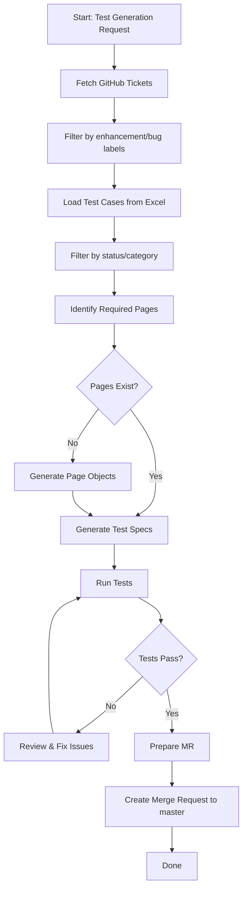

# Orchestrator Agents for Playwright Pet Project

This file defines custom agents for automating test creation, GitHub ticket processing, and merge request workflows.

---

## Agent: Test Generator Orchestrator
<<<<<<< HEAD
<<<<<<< HEAD
=======
>>>>>>> 35565bf (Finalize agents)

**Purpose**: Main orchestrator that guides the workflow for creating tests from GitHub tickets and test cases for the Tricentis Demo Web Shop.

**Application**: https://demowebshop.tricentis.com/ (nopCommerce E-commerce Platform)
<<<<<<< HEAD
=======
**Purpose**: Main orchestrator that guides the workflow for creating tests from GitHub tickets and test cases.
>>>>>>> 4475e1c (feat: Extend agents with Demo Web Shop application reference)
=======
>>>>>>> 35565bf (Finalize agents)

**Trigger**: Manual invocation or GitHub workflow

**Responsibilities**:
<<<<<<< HEAD
<<<<<<< HEAD

1. Coordinate ticket fetching from GitHub
2. Filter and process Excel test cases
3. Generate page object models (with Demo Web Shop templates)
=======
1. Coordinate ticket fetching from GitHub
2. Filter and process Excel test cases
3. Generate page object models
>>>>>>> 4475e1c (feat: Extend agents with Demo Web Shop application reference)
=======

1. Coordinate ticket fetching from GitHub
2. Filter and process Excel test cases
3. Generate page object models (with Demo Web Shop templates)
>>>>>>> 35565bf (Finalize agents)
4. Generate .spec.ts test files
5. Validate and run tests
6. Prepare merge request

---

## Agent: GitHub Ticket Fetcher
<<<<<<< HEAD
<<<<<<< HEAD
=======
>>>>>>> 35565bf (Finalize agents)

**Purpose**: Fetch and filter GitHub issues from the repository.

**Responsibilities**:

<<<<<<< HEAD
=======
**Purpose**: Fetch and filter GitHub issues from the repository.

**Responsibilities**:
>>>>>>> 4475e1c (feat: Extend agents with Demo Web Shop application reference)
=======
>>>>>>> 35565bf (Finalize agents)
- Connect to GitHub API
- Fetch issues labeled 'enhancement' or 'bug'
- Format ticket data for test generation
- Track issue relationships

**Configuration**:
<<<<<<< HEAD
<<<<<<< HEAD

=======
>>>>>>> 4475e1c (feat: Extend agents with Demo Web Shop application reference)
=======

>>>>>>> 35565bf (Finalize agents)
- Labels: enhancement, bug
- State: open
- Sort: updated, desc

---

## Agent: Test Case Processor
<<<<<<< HEAD
<<<<<<< HEAD
=======
>>>>>>> 35565bf (Finalize agents)

**Purpose**: Read, parse, and filter test cases from Excel file.

**Responsibilities**:

<<<<<<< HEAD
=======
**Purpose**: Read, parse, and filter test cases from Excel file.

**Responsibilities**:
>>>>>>> 4475e1c (feat: Extend agents with Demo Web Shop application reference)
=======
>>>>>>> 35565bf (Finalize agents)
- Parse testcases/automation_practice_testcases.xlsx
- Filter by status/category
- Map test cases to domains/features
- Generate test case specifications
- Identify required page objects

**File**: testcases/automation_practice_testcases.xlsx

---

## Agent: Page Object Generator
<<<<<<< HEAD
<<<<<<< HEAD
=======
>>>>>>> 35565bf (Finalize agents)

**Purpose**: Create new page object models based on test case requirements for the Demo Web Shop application.

**Application**: Tricentis Demo Web Shop (https://demowebshop.tricentis.com/)
<<<<<<< HEAD

**Responsibilities**:

- Analyze test cases to identify required pages/components
- Use Demo Web Shop page object templates as reference
- Generate page objects in pages/ directory with proper selectors
- Create methods for page interactions (login, search, cart, checkout, etc.)
- Follow existing project patterns (pages/mainpage.ts, pages/registerpage.ts)
- Reference selectors from APPLICATION.md and demo-web-shop-pagobjects.agent.md

**Available Templates**:

- BasePage (foundation for all pages)
- HomePage (main landing page)
- LoginPage (authentication)
- RegisterPage (user registration)
- ProductPage (product details)
- CartPage (shopping cart)
- SearchResultsPage (search)
- CategoryPage (product categories)
- AccountPage (user account)
=======
**Purpose**: Create new page object models based on test case requirements.
=======
>>>>>>> 35565bf (Finalize agents)

**Responsibilities**:

- Analyze test cases to identify required pages/components
- Use Demo Web Shop page object templates as reference
- Generate page objects in pages/ directory with proper selectors
- Create methods for page interactions (login, search, cart, checkout, etc.)
- Follow existing project patterns (pages/mainpage.ts, pages/registerpage.ts)
<<<<<<< HEAD
>>>>>>> 4475e1c (feat: Extend agents with Demo Web Shop application reference)
=======
- Reference selectors from APPLICATION.md and demo-web-shop-pagobjects.agent.md

**Available Templates**:

- BasePage (foundation for all pages)
- HomePage (main landing page)
- LoginPage (authentication)
- RegisterPage (user registration)
- ProductPage (product details)
- CartPage (shopping cart)
- SearchResultsPage (search)
- CategoryPage (product categories)
- AccountPage (user account)
>>>>>>> 35565bf (Finalize agents)

**Output Location**: pages/

---

## Agent: Spec Generator
<<<<<<< HEAD
<<<<<<< HEAD
=======
>>>>>>> 35565bf (Finalize agents)

**Purpose**: Generate Playwright test specification files.

**Responsibilities**:

<<<<<<< HEAD
=======
**Purpose**: Generate Playwright test specification files.

**Responsibilities**:
>>>>>>> 4475e1c (feat: Extend agents with Demo Web Shop application reference)
=======
>>>>>>> 35565bf (Finalize agents)
- Create .spec.ts files in tests/ directory
- Import required page objects
- Generate test cases from specifications
- Use proper Playwright patterns
- Follow existing project structure (tests/login.spec.ts, tests/register.spec.ts)

**Output Location**: tests/

---

## Agent: Test Validator
<<<<<<< HEAD
<<<<<<< HEAD
=======
>>>>>>> 35565bf (Finalize agents)

**Purpose**: Run tests and validate implementation.

**Responsibilities**:

<<<<<<< HEAD
=======
**Purpose**: Run tests and validate implementation.

**Responsibilities**:
>>>>>>> 4475e1c (feat: Extend agents with Demo Web Shop application reference)
=======
>>>>>>> 35565bf (Finalize agents)
- Execute test suite: `npm test`
- Validate all tests pass
- Generate test report
- Identify failures for remediation

---

## Agent: Merge Request Creator
<<<<<<< HEAD
<<<<<<< HEAD
=======
>>>>>>> 35565bf (Finalize agents)

**Purpose**: Create merge request on GitHub/GitLab.

**Responsibilities**:

<<<<<<< HEAD
=======
**Purpose**: Create merge request on GitHub/GitLab.

**Responsibilities**:
>>>>>>> 4475e1c (feat: Extend agents with Demo Web Shop application reference)
=======
>>>>>>> 35565bf (Finalize agents)
- Target branch: master
- Generate PR description from ticket and test info
- Link related GitHub issues
- Create branch with naming convention: `add_tests_<ticket-id>`

---

## Workflow Sequence

## Getting Started

To trigger the test generation workflow:

1. **Fetch GitHub Tickets**: Run the GitHub Ticket Fetcher agent
   - Provide authentication token (GitHub PAT)
   - Confirm labels to filter: enhancement, bug

2. **Process Test Cases**: Run the Test Case Processor agent
   - Specify Excel file path: testcases/automation_practice_testcases.xlsx
   - Select status/category filters

3. **Generate Tests**: Run the Test Generator Orchestrator
   - Review page object requirements
   - Generate page objects (if needed)
   - Generate test specs

4. **Validate**: Run the Test Validator agent
   - Execute tests with `npm test`
   - Review test results

5. **Create MR**: Run the Merge Request Creator agent
   - Confirm MR details
   - Target branch: master
   - Create PR

## Configuration Files

<<<<<<< HEAD
<<<<<<< HEAD
- Agent definitions: `.github/AGENTS.md` (this file)
- Individual agent prompts: `.github/agents/*.agent.md`
- Application reference: `.github/APPLICATION.md` (Demo Web Shop details)
- Demo Web Shop page objects: `.github/agents/demo-web-shop-pagobjects.agent.md`
- GitHub workflows: `.github/workflows/`

## Application Under Test

**Demo Web Shop**: https://demowebshop.tricentis.com/

- **Type**: nopCommerce E-commerce Platform
- **Features**: Product browsing, search, user registration/login, shopping cart, checkout
- **Test Scenarios**: Authentication, shopping, cart management, product search, account management
- **Documentation**: See `.github/APPLICATION.md` for complete reference
- **Page Objects**: See `.github/agents/demo-web-shop-pagobjects.agent.md` for templates

---

=======
- Agent definitions: `.github/AGENTS.md`
=======
- Agent definitions: `.github/AGENTS.md` (this file)
>>>>>>> 35565bf (Finalize agents)
- Individual agent prompts: `.github/agents/*.agent.md`
- Application reference: `.github/APPLICATION.md` (Demo Web Shop details)
- Demo Web Shop page objects: `.github/agents/demo-web-shop-pagobjects.agent.md`
- GitHub workflows: `.github/workflows/`

<<<<<<< HEAD
>>>>>>> 4475e1c (feat: Extend agents with Demo Web Shop application reference)
=======
## Application Under Test

**Demo Web Shop**: https://demowebshop.tricentis.com/

- **Type**: nopCommerce E-commerce Platform
- **Features**: Product browsing, search, user registration/login, shopping cart, checkout
- **Test Scenarios**: Authentication, shopping, cart management, product search, account management
- **Documentation**: See `.github/APPLICATION.md` for complete reference
- **Page Objects**: See `.github/agents/demo-web-shop-pagobjects.agent.md` for templates

---

>>>>>>> 35565bf (Finalize agents)
## Notes

- GitHub PAT required for API access (stored in `pat.txt`)
- Excel file must contain columns: test_id, title, description, status, category
- Page objects follow pattern: class with page locators and interaction methods
- Test specs follow pattern: describe blocks with test cases
<<<<<<< HEAD
<<<<<<< HEAD
- All tests run against: https://demowebshop.tricentis.com/
- Page object templates available in demo-web-shop-pagobjects.agent.md
- Use Application.md for selector reference and page element details
=======
>>>>>>> 4475e1c (feat: Extend agents with Demo Web Shop application reference)
=======
- All tests run against: https://demowebshop.tricentis.com/
- Page object templates available in demo-web-shop-pagobjects.agent.md
- Use Application.md for selector reference and page element details
>>>>>>> 35565bf (Finalize agents)
