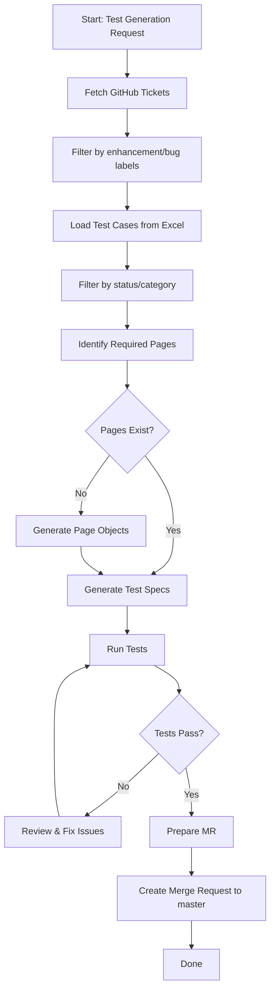

# Orchestrator Agents for Playwright Pet Project

This file defines custom agents for automating test creation, GitHub ticket processing, and merge request workflows.

---

## Agent: Test Generator Orchestrator
**Purpose**: Main orchestrator that guides the workflow for creating tests from GitHub tickets and test cases.

**Trigger**: Manual invocation or GitHub workflow

**Responsibilities**:
1. Coordinate ticket fetching from GitHub
2. Filter and process Excel test cases
3. Generate page object models
4. Generate .spec.ts test files
5. Validate and run tests
6. Prepare merge request

---

## Agent: GitHub Ticket Fetcher
**Purpose**: Fetch and filter GitHub issues from the repository.

**Responsibilities**:
- Connect to GitHub API
- Fetch issues labeled 'enhancement' or 'bug'
- Format ticket data for test generation
- Track issue relationships

**Configuration**:
- Labels: enhancement, bug
- State: open
- Sort: updated, desc

---

## Agent: Test Case Processor
**Purpose**: Read, parse, and filter test cases from Excel file.

**Responsibilities**:
- Parse testcases/automation_practice_testcases.xlsx
- Filter by status/category
- Map test cases to domains/features
- Generate test case specifications
- Identify required page objects

**File**: testcases/automation_practice_testcases.xlsx

---

## Agent: Page Object Generator
**Purpose**: Create new page object models based on test case requirements.

**Responsibilities**:
- Analyze test cases to identify required pages/components
- Generate page objects in pages/ directory
- Create selectors and methods for page interactions
- Follow existing project patterns (pages/mainpage.ts, pages/registerpage.ts)

**Output Location**: pages/

---

## Agent: Spec Generator
**Purpose**: Generate Playwright test specification files.

**Responsibilities**:
- Create .spec.ts files in tests/ directory
- Import required page objects
- Generate test cases from specifications
- Use proper Playwright patterns
- Follow existing project structure (tests/login.spec.ts, tests/register.spec.ts)

**Output Location**: tests/

---

## Agent: Test Validator
**Purpose**: Run tests and validate implementation.

**Responsibilities**:
- Execute test suite: `npm test`
- Validate all tests pass
- Generate test report
- Identify failures for remediation

---

## Agent: Merge Request Creator
**Purpose**: Create merge request on GitHub/GitLab.

**Responsibilities**:
- Target branch: master
- Generate PR description from ticket and test info
- Link related GitHub issues
- Create branch with naming convention: `add_tests_<ticket-id>`

---

## Workflow Sequence

## Getting Started

To trigger the test generation workflow:

1. **Fetch GitHub Tickets**: Run the GitHub Ticket Fetcher agent
   - Provide authentication token (GitHub PAT)
   - Confirm labels to filter: enhancement, bug

2. **Process Test Cases**: Run the Test Case Processor agent
   - Specify Excel file path: testcases/automation_practice_testcases.xlsx
   - Select status/category filters

3. **Generate Tests**: Run the Test Generator Orchestrator
   - Review page object requirements
   - Generate page objects (if needed)
   - Generate test specs

4. **Validate**: Run the Test Validator agent
   - Execute tests with `npm test`
   - Review test results

5. **Create MR**: Run the Merge Request Creator agent
   - Confirm MR details
   - Target branch: master
   - Create PR

## Configuration Files

- Agent definitions: `.github/AGENTS.md`
- Individual agent prompts: `.github/agents/*.agent.md`
- GitHub workflows: `.github/workflows/`

## Notes

- GitHub PAT required for API access (stored in `pat.txt`)
- Excel file must contain columns: test_id, title, description, status, category
- Page objects follow pattern: class with page locators and interaction methods
- Test specs follow pattern: describe blocks with test cases
